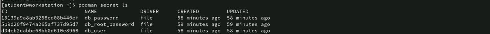
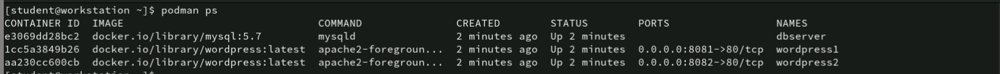
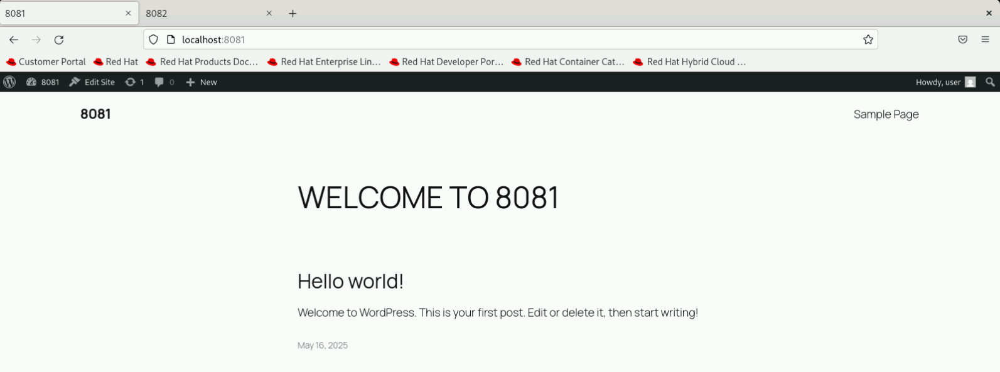
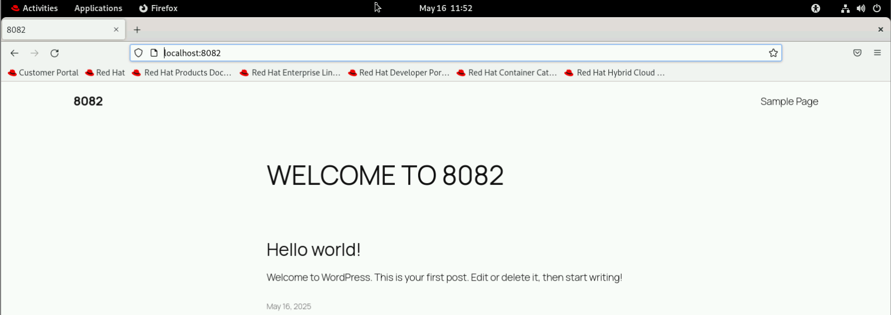

# WordPress Multi-Site Environment with Podman

This Compose file sets up a **multi-container WordPress environment** using **Podman**, with secure handling of sensitive data through **Podman Secrets**.  
They're 2 wordpress conainers that are sharing the same database container
---

## Setup Overview

### 1. Two Independent WordPress Sites

- **wordpress1**  
  - Accessible at `${WORDPRESS1_PORT}` (`http://localhost:8081`).
  - Uses database table prefix: `wp_1`.

- **wordpress2**  
  - Accessible at `${WORDPRESS2_PORT}` (`http://localhost:8082`).
  - Uses database table prefix: `wp_2`.

> Note that: **Each site shares the same MySQL database but stores its data in separate tables, avoiding conflicts.**

---

### 2. One Shared MySQL Database Container

- **Service Name:** `dbserver`
- Data is persisted in a named volume: `dbdata`.
- Credentials and passwords are securely managed using Podman Secrets.

---

### 3. Secure Credential Management

- Secrets are created using Podman and mounted inside containers at `/run/secrets/`.
- Environment variables use the `_FILE` convention to load sensitive values directly from secrets.
- No sensitive data is stored in plain text.

---

### 4. Custom Network

- All containers communicate over a private Docker network `appnet`.
- Ensures secure and isolated internal communication.

---

### 5. Persistent Data Storage

- MySQL data is stored in a persistent volume `dbdata`.
- Data remains even if containers are stopped or removed.

---

## How to Deploy

### 1. Create Required Secrets

```bash
echo "root" | podman secret create db_root_password -
echo "user" | podman secret create db_user -
echo "pass" | podman secret create db_password -
```



to check the secrets and some queries inside the databse
```
podman exec -it wordpress1 cat /run/secrets/db_user
```
```
podman exec -it dbserver bash
mysql -u user -p
USE db;
SHOW TABLES;
SELECT ID, post_title, post_status FROM wp2_posts WHERE post_type = 'post';
```

### 2. Start the Environment
```
podman-compose up -d
```


### Lastly, access the websites from the local browser

WordPress site 1 --> `http://localhost:8081`
WordPress site 2 --> `http://localhost:8082`



