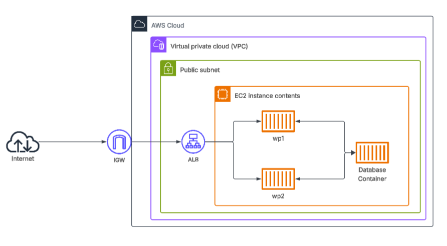
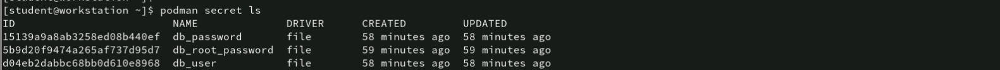
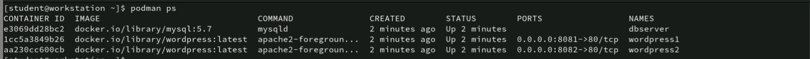
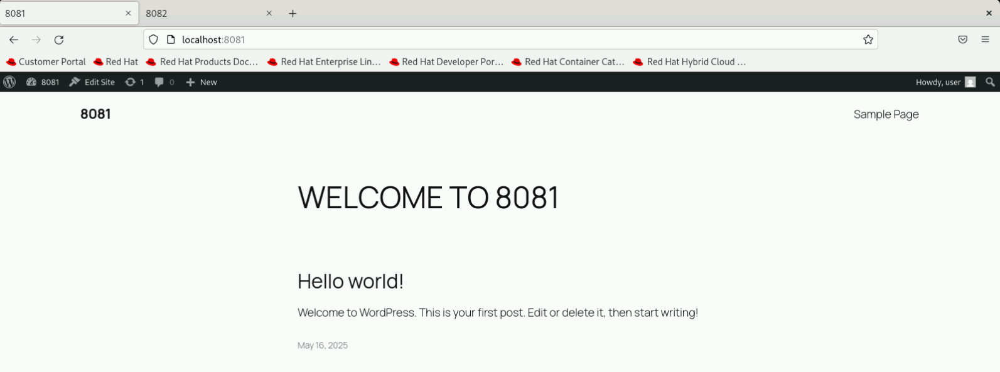
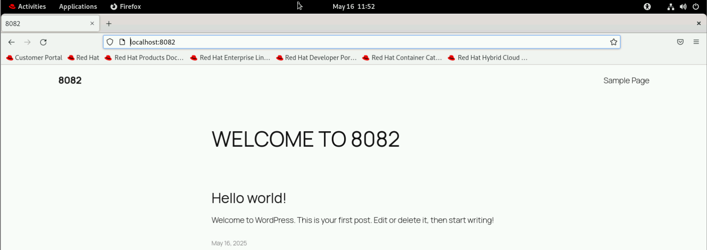

# WordPress Multi-Site Environment on an EC2 with Podman  
---

This Compose file defines a multi-container environment using Podman to deploy two separate WordPress websites (wordpress1 and wordpress2) that share a common mysql database (dbserver) on ONE ec2 instance. Each WordPress site uses a different database table prefix to isolate its data within the shared database. Sensitive credentials like database passwords are securely managed using Podman Secrets, and all containers communicate over a private network appnet. This setup ensures secure, efficient, and persistent deployment of multiple independent WordPress sites on a single infrastructure.



## Setup Overview

### 1. Two Independent WordPress Sites

- **wordpress1**  
  - Accessible at `${WORDPRESS1_PORT}` (`http://localhost:8081`).
  - Uses database table prefix: `wp_1`.

- **wordpress2**  
  - Accessible at `${WORDPRESS2_PORT}` (`http://localhost:8082`).
  - Uses database table prefix: `wp_2`.

> Note that: **Both sites shares the same MySQL database but stores their data in separate tables, avoiding conflicts.**

---

### 2. One Shared MySQL Database Container

- **Service Name:** `dbserver`
- Data is persisted in a named volume: `dbdata`.
- Credentials and passwords are securely managed using Podman Secrets.

---

### 3. Secure Credential Management

- , **Secrets** are a secure way to handle sensitive information such as passwords, API keys, database credentials, and tokens outside of plain text files like compose.yaml or .env files, they are created using Podman and mounted inside containers at `/run/secrets/`.
- Environment variables use the `_FILE` convention to load sensitive values directly from secrets.
- No sensitive data is stored in plain text.

---

### 4. Custom Network

- All containers communicate over a private Docker network `appnet`.
- Ensures secure and isolated internal communication.

---

### 5. Persistent Data Storage

- MySQL data is stored in a persistent volume `dbdata`.
- Data remains even if containers are stopped or removed.

---

## How to Deploy

### 1. Create Required Secrets

```bash
echo "root" | podman secret create db_root_password -
echo "user" | podman secret create db_user -
echo "pass" | podman secret create db_password -
```



to check the secrets and some queries inside the databse
```bash
podman exec -it wordpress1 cat /run/secrets/db_user
```
```bash
podman exec -it dbserver bash
mysql -u user -p
USE db;
SHOW TABLES;
SELECT ID, post_title, post_status FROM wp2_posts WHERE post_type = 'post';
```

### 2. Start the Environment
```
podman-compose up -d
```


### Lastly, access the websites from the local browser

WordPress site 1 --> `http://localhost:8081`
WordPress site 2 --> `http://localhost:8082`



